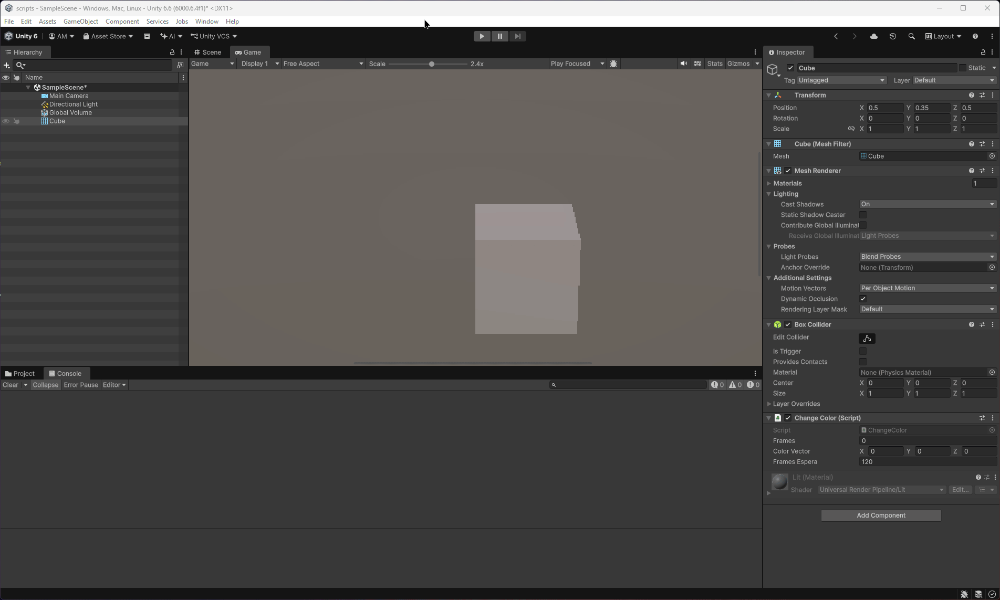
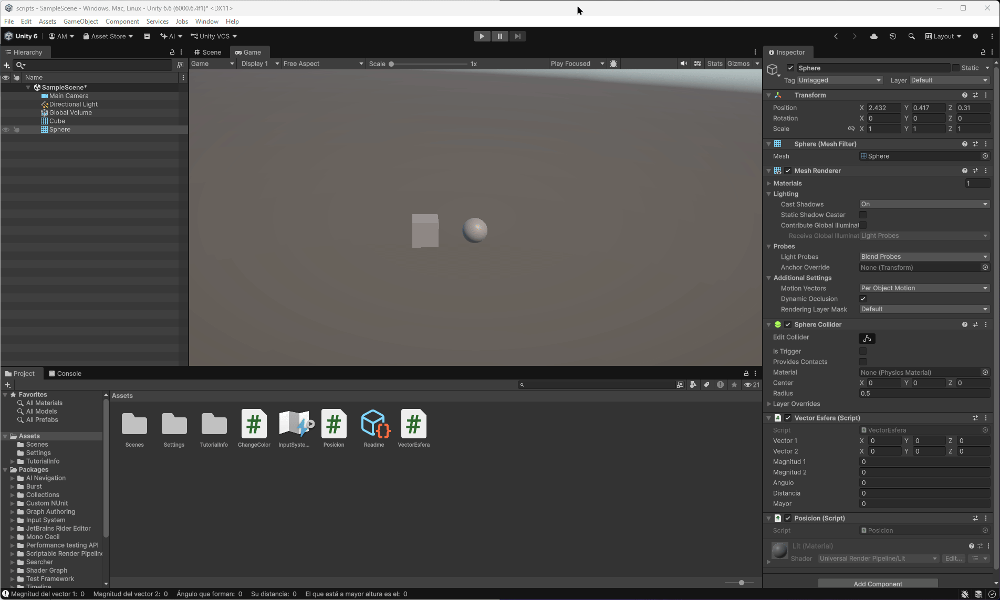
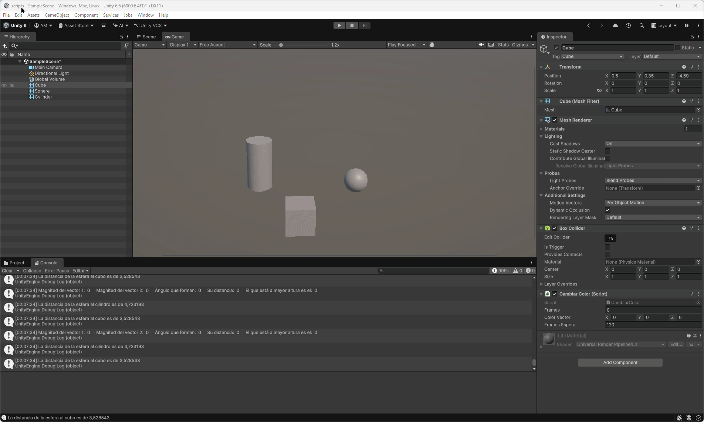

# Ejercicios

### 1. Crea un script asociado a un objeto en la escena que inicialice un vector de 3 posiciones con valores entre 0.0 y 1.0, para tomarlo como un vector de color (Color). Cada 120 frames se debe cambiar el valor de una posición aleatoria y asignar el nuevo color al objeto. Parametrizar la cantidad de frames de espera para poderlo cambiar desde el inspector.

### 2. Crea un script asociado a la esfera con dos variables Vector3 públicas. Dale valor a cada componente de los vectores desde el inspector. Muestra en la consola: a. La magnitud de cada uno de ellos. b. El ángulo que forman. c. La distancia entre ambos. d. Un mensaje indicando qué vector está a una altura mayor. Muestra en el inspector cada uno de esos valores.

### 3. Muestra en pantalla el vector con la posición de la esfera.

### 4. Crea un script para la esfera que muestre en consola la distancia a la que están el cubo y el cilindro.

